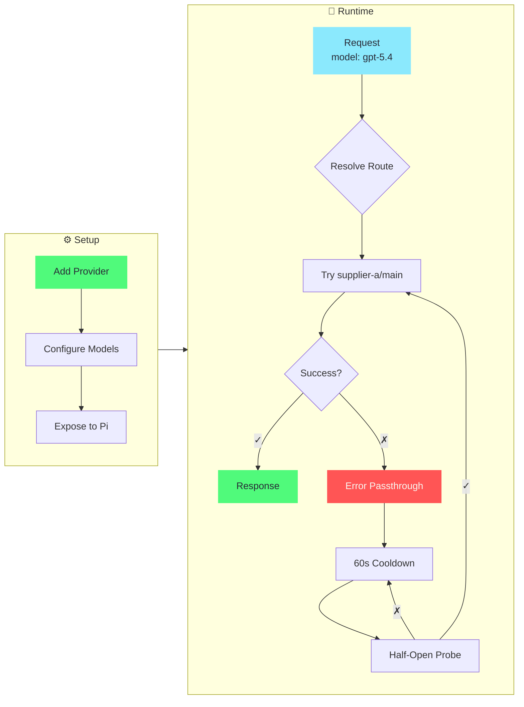

<div align="center">

# pi-switch

[](https://github.com/heihei0299/pi-switch/releases)
[](https://github.com/heihei0299/pi-switch/releases)
[](https://go.dev/)
[](LICENSE)

**WebUI-first control plane for pi agent**

Manage provider profiles and run a local model-name routing gateway — via a browser-first WebUI, with CLI and TUI on the same Go core (gin + bubbletea).

[English](#) | [中文](README_ZH.md)

</div>

---

## 📸 Screenshots — WebUI

<div align="center">


<br/>


<br/>
<sub>Home · Profiles · Gateway (Current vs Proposed) · Stats — dark theme, 1280×800. &nbsp; TUI remains available: <code>assets/main.png</code></sub>
</div>

---

## 📥 Installation

```bash
# npm (recommended)
npm install -g @heihei0299/pi-switch

# or via pi
pi install npm:@heihei0299/pi-switch
```

**Build from source** (requires Node.js >= 20, Go 1.23+):

```bash
git clone https://github.com/heihei0299/pi-switch.git
cd pi-switch
npm install
npm run build              # builds webui/dist + go build (embeds webui via embed.FS)
# or step by step:
# npm run build:webui      # vite build → webui/dist
# npm run build:go         # go build with version injected from package.json via ldflags (embeds webui/dist)
node bin/pi-switch.js webui start --daemon
# open http://127.0.0.1:43110
```

### System Compatibility

**Supported platforms:**
- ✅ Windows (x64)
- ✅ macOS (Intel & Apple Silicon)
- ✅ Linux (x64) - glibc & musl

**Linux users:** Go build uses `modernc.org/sqlite` (pure Go, no CGO) — single static binary, no glibc/musl distinction needed.

**Cross-compile (no CGO):**
```bash
npm run build:all  # GOOS=linux/darwin/windows × GOARCH=amd64/arm64 → bin/pi-switch-*
# Wrapper bin/pi-switch.js selects correct binary via process.platform/arch
```

---

## 🚀 Quick Start — WebUI first

```bash
pi-switch webui start --daemon  # Browser UI at http://127.0.0.1:43110 (recommended)
pi-switch tui                   # Interactive TUI (alternative)
pi-switch doctor                # Run environment diagnostics
```

> **WebUI is the primary interface.** CLI, TUI, and WebUI are thin adapters over the same
> Go core (gin + bubbletea). The WebUI covers Profiles, Gateway, Proxy, Stats and Settings in the browser;
> TUI and CLI expose the same operations for terminal workflows.
> See [WEBUI_GUIDE.md](./WEBUI_GUIDE.md) for architecture, the 4-step recipe for adding operations, and the full REST ↔ core map.

### Essential Commands — CLI & WebUI equivalents

```bash
# Provider management (CLI)
pi-switch provider add <name> [--preset <id>] [--api-key <key>]
pi-switch provider list
pi-switch provider show <name>
pi-switch provider delete <name>
pi-switch provider expose <name> <model-ids...>    # Expose models to pi agent
pi-switch provider fetch-models <name>             # Fetch models from API

# In WebUI: Profiles → + Add profile / Import from cc-switch → Edit → Expose

# Proxy (gateway)
pi-switch proxy start --daemon                     # Start proxy daemon
pi-switch proxy status

# In WebUI: Gateway → Current vs Proposed → Apply to Pi,  Proxy → Start/Stop

# Package management
pi-switch package list                             # List installed packages
pi-switch package add <spec> [--disabled]          # Add a package; spec is ONE token, e.g. npm:pkg or ./dir
pi-switch package remove <id>                      # Remove package
pi-switch package show <id>                        # Show package details
pi-switch package import                           # Import packages found in the pi agent directory

# In WebUI: Packages → Add / Toggle / Remove

# WebUI (browser config) — always use --daemon so it runs in the
# background and can be stopped with `pi-switch webui stop`.
# Binding a non-loopback --host requires a password: set
# PI_SWITCH_WEBUI_PASSWORD, or pass --generate-password to have one written to
# ~/.pi-switch/webui_password (0600); otherwise startup is refused.
pi-switch webui start --daemon [--host <ip>] [--port <port>] [--generate-password]
pi-switch webui status
pi-switch webui stop

# Other
pi-switch presets                                   # List built-in presets
pi-switch presets show <id>                         # Show one preset
pi-switch config show                               # Display current config path
pi-switch stats                                     # Not implemented — exits non-zero
```

---

## ✨ Features

| Category | Highlights |
|----------|------------|
| 🌐 **WebUI (primary)** | Browser control plane at `http://127.0.0.1:43110` — Profiles CRUD, Gateway `Current vs Proposed` diff & `Apply to Pi`, Proxy control, Stats dashboard with time windows, Packages, Settings, Doctor. Daemon-managed (own pid/log/port), loopback-open / non-loopback Basic auth. |
| 🔌 **Provider Management** | CRUD, duplicate, search/filter, model management, **multi-upstream** (`upstreams[]` with api/baseUrl/apiKey/headers/weight/name, each channel carrying its own `models`/`exposedModels` partition), per-channel fetch/expose, gateway publish with secondary model selection, configure Responses API passthrough/conversion mode |
| ⇥ **cc-switch Import** | One-click import of providers from cc-switch (Claude Code / Codex / Gemini), dedup by base URL, skip official presets — CLI, TUI, WebUI |
| 💡 **Built-in Presets** | OpenRouter, Anthropic, DeepSeek, SiliconFlow, OpenAI — add profiles instantly |
| 🌉 **Model-Name Gateway** | **Independent** process/plugin — Profiles only write local config, Gateway explicitly publishes at most two fixed providers (`pi-switch-res` / `pi-switch-chat`) to `~/.pi/agent/models.json` via `Current vs Proposed` preview & `Apply to Pi`; stateless bare-model routing, SSE streaming, User-Agent disguise, OpenAI ↔ Anthropic & Responses ↔ Chat Completions, circuit breaker |
| 🗂️ **Model Catalog** | Fill missing model metadata (cost/limit/reasoning/input/name) from https://models.dev snapshot cached at `~/.pi-switch/cache/models-dev.json` (24h TTL, stale fallback with warning): fetch-time enrich via per-profile `modelsDevProvider` mapping, plus gateway preview/publish fill-missing (existing values win, pools untouched, ambiguous names skipped) |
| 📦 **Package Management** | Install, enable/disable, and manage packages across CLI, TUI, and WebUI |
| 🖥️ **TUI (secondary)** | charmbracelet/bubbletea + lipgloss + bubbles — profile list/switch, gateway publish, stats (totalCost ` - ` / `$0.00` / `$1.2K`), full parity with WebUI/CLI |
| 🌐 **Bilingual** | English / 中文, persisted to config, toggle in Settings |
| 📊 **Usage Stats** | Per-provider, per-model request metrics & latency; four-dimension token totals (input/output/cached/reasoning), cache hit rate, time-window queries (today/24h/7d/custom), per-conversation breakdown — see [WEBUI_GUIDE.md](./WEBUI_GUIDE.md) for the data model |
| 💾 **Backup & Sync** | Auto-backup on mutation, AES-256-CBC encrypted export/import |
| 🩺 **Diagnostics** | `doctor` command checks config, models.json, structure |

---

## ⇥ Import from cc-switch

Already using [cc-switch](https://github.com/farion1231/cc-switch)? You can import its providers into pi-switch with one command instead of re-adding them by hand:

```bash
pi-switch import ccswitch                 # interactive selection
pi-switch import ccswitch --all           # import everything new
pi-switch import ccswitch --path /path/to/cc-switch.db   # custom db location
```

- Reads `~/.cc-switch/cc-switch.db` (SQLite, read-only — cc-switch is never modified)
- Maps the three common client types: **Claude** → `anthropic-messages`, **Codex** → `openai-responses`, **Gemini** → `google-generative-ai`
- Official presets (e.g. `claude-official`) are skipped
- **Dedup by base URL**: providers already in pi-switch are flagged as existing and skipped (use `--force` to overwrite)
- Name collisions resolve to `name (cc)` instead of silently overwriting
- If the default db path is missing, you are prompted for the path to `cc-switch.db` (or you can cancel)

Available in all three UIs: CLI (`pi-switch import ccswitch`), TUI (Profiles → `i`), WebUI (Profiles → *Import from cc-switch*).

---

## 📊 Usage Statistics

Every proxied request is appended to `~/.pi-switch/requests.log` as a JSON line. For streaming responses the upstream SSE stream is teed: each request's input/output/cached/reasoning token counts (when the upstream reports them) and conversation id are parsed on the side and the log line is written when the stream ends — the stream itself is never buffered. Reasoning tokens are a subset of output tokens (parsed from `completion_tokens_details.reasoning_tokens` / `output_tokens_details.reasoning_tokens` where the upstream reports them); they never inflate the total.

- **WebUI Stats page** — token totals as five tiles (Input / Output / Cached / Reasoning / Total) with subset badges, plus `By provider` / `By conversation` tables, a time-range picker (Today / Last 24h / Last 7d / Custom), auto-refresh tiers (Off / 5s / 30s / 5min) and recent-request details (paginated, with status, latency, cache rate).
- **Stats API** (`GET /api/stats`) returns `totalTokens` with four dimensions — input / output / cached / reasoning (`total = input + output`, reasoning is a subset of output) — plus `cacheHitRate`, per-provider and per-model detail columns and `byConversation`.
- For the full data model, window semantics and log schema, see [WEBUI_GUIDE.md](./WEBUI_GUIDE.md) and the `stats.rs` / `usage.rs` modules — the README keeps only the overview to stay thin.

---

## 🎯 Core Workflow

### Gateway Routing



### Step by Step — WebUI first

**1. Add a provider** — WebUI: `Profiles → + Add profile → fill form → Save`; or CLI:

```bash
pi-switch provider add provider-a --api openai-completions --base-url https://api.example.com/v1 \
    --api-key '$API_KEY' --models gpt-5.4,claude-sonnet-4-5
```

_TUI: `Profiles → a → fill form → Ctrl+S` still works as a terminal alternative._

**2. Expose models to pi agent** — WebUI: `Profiles → select provider → Models → check → Save` (writes only `~/.pi-switch/config.json`); or CLI:

```bash
pi-switch provider expose provider-a gpt-5.4
```

**2.5 Publish to Pi** — Gateway explicitly writes at most two fixed providers: `pi-switch-res` (Responses) and `pi-switch-chat` (Chat). Models are aggregated by their exposed Channel API contract.

```bash
# WebUI: Gateway → Current vs Proposed → Apply to Pi
# or via API: PUT /api/models/gateway
```

In WebUI: `Gateway → Apply to Pi` (shows pending diff, supports rollback). The Supplier vs gateway isolation guarantees Profiles mutations never auto-write `~/.pi/agent/models.json` — you publish explicitly.

**3. Start the proxy** — it reads the published fixed gateway providers

```bash
pi-switch proxy start --daemon
```

_WebUI: `Proxy → Start` (same daemon, WebUI shows status)._

**4. Use in pi** — select `pi-switch-res` for Responses models or `pi-switch-chat` for Chat models, then pick a bare model ID like `gpt-5.4`

### How Gateway Routing Works

Requests are routed by the model name in the request body — no out-of-band state, no "current target":

- **Bare model routing** — `"model": "gpt-5.4"` resolves to the unique exposed supplier/channel; duplicate exposed IDs are rejected by gateway validation and unresolved duplicates return an ambiguity error
- **Fixed gateway providers** — pi sees at most `pi-switch-res` and `pi-switch-chat`; their model lists are aggregated by the Channel API contract
- **Gateway validation** — unsupported Channel APIs are skipped with a preview diagnostic; duplicate exposed bare IDs and additional providers using `pi-switch-proxy` are rejected atomically, while third-party providers remain untouched
- **Legacy provider migration** — the first fixed-provider publish removes old pi-switch Supplier/Channel entries, migrates uniquely owned model-level fields, prioritizes existing fixed-provider edits, and keeps third-party providers
- **Source routing** — the proxy keeps Supplier/Channel credentials and routes each bare model id to its unique exposed source
- **Circuit breaker** — after 3 consecutive failures, provider enters 60s cooldown; auto-recovery on half-open probe success
- **Streaming (SSE)** — same-format requests (openai→openai, anthropic→anthropic) stream token-by-token, as do Responses↔Chat cross-format routes (converted both directions); upstream response headers (Content-Type, etc.) are preserved
- **OpenAI ↔ Anthropic** — transparently converts between chat completions and messages APIs
- **User-Agent disguise** — built-in presets (Claude Code / Codex / Gemini) send the matching client's real User-Agent (and headers like `anthropic-beta`) to pass upstream client checks; settable globally or per-profile

> **Known limitation** — the OpenAI ↔ Anthropic **conversion** path can't stream: it parses the full JSON to convert formats. If pi sends `stream: true` but the model routes to a cross-format upstream (OpenAI request → Anthropic upstream, or vice-versa), the reply comes back as a single non-streamed response. Same-format routes stream normally.

---

## 🏗️ Architecture

```
pi-switch/
├── bin/pi-switch.js         # Node wrapper — selects Go binary by platform/arch → bin/pi-switch-<goos>-<goarch>
├── bin/pi-switch-*          # Go binaries (linux/darwin/windows × amd64/arm64, pure Go)
├── cmd/pi-switch/main.go    # Go entry (gin + proxy/mgmt routers, daemon, tui)
├── internal/
│   ├── config/              # Config load/save, types, per-request hot reload, v1→v2 migration
│   ├── gateway/             # Gateway publish (models.json: fixed pi-switch-res/pi-switch-chat providers)
│   ├── proxy/               # Proxy helpers (cost, limit clamp)
│   ├── limit/               # contextWindow/maxTokens clamp (est=ceil(jsonLen/4), reserve 4096)
│   ├── translator/          # OpenAI ↔ Anthropic ↔ Responses conversion (native/convert via responsesMode)
│   ├── server/              # gin routers (proxy :43112, mgmt :43110, /api/*, embed.FS)
│   ├── store/               # SQLite (modernc.org/sqlite, pure Go) + requests log
│   ├── scan/                # sessionScan (offline ~/.pi/agent/sessions JSONL correlation)
│   ├── daemon/              # Daemon lifecycle (pid files ~/.pi-switch/*.pid, ss multi-instance hint)
│   ├── tui/                 # Terminal UI (charmbracelet/bubbletea + bubbles + lipgloss)
│   └── usage/               # SSE usage parser (StreamTee)
├── webui/                   # React frontend (Vite + Tailwind, embedded via embed.FS)
│   ├── src/components/      # Home, Profiles, Gateway, Proxy, Stats, etc.
│   └── dist/                # vite build (embedded into Go binary via webui/embed.go)
├── scripts/build-all.sh     # Cross-compile matrix GOOS×GOARCH (no CGO)
└── go.mod
```

**Config files:**
- `~/.pi-switch/config.json` — profiles and proxy settings
- `~/.pi-switch/requests.db` — SQLite (modernc) per-request log (status, latency, token usage, cost, conversation) — zero-migration from old requests.log + .db
- `~/.pi-switch/backups/` — timestamped backups written by the legacy JS implementation; **the Go build has no backup implementation** (`GET /api/backups` and config export/import/restore all answer 501)
- `~/.pi/agent/models.json` — pi's provider registry (pi-switch writes at most the fixed `pi-switch-res` and `pi-switch-chat` providers)

For the WebUI's thin-adapter architecture, the 4-step recipe for adding operations, and the REST ↔ core map, see [WEBUI_GUIDE.md](./WEBUI_GUIDE.md) — that guide is the thick reference; this README stays thin.

---

## ❓ FAQ

<details>
<summary><b>How do I switch models in pi?</b></summary>
<br>

In pi, open `/model`, select the published `pi-switch-res` or `pi-switch-chat` provider, and pick one of its bare model IDs (for example `gpt-5.4`). The proxy routes by the model name in each request — no extra step needed.

To add more models, expose them in WebUI (`Profiles → select provider → Models`) or via CLI:
```bash
pi-switch provider expose <name> <model-id>...
```

</details>


<details>
<summary><b>What does the [proxy] badge mean?</b></summary>
<br>

The `[proxy]` badge indicates this profile is a meta-profile (with `"proxy": true`). Proxy profiles are used to register a pi provider that points to the local gateway. They are excluded from upstream routing.

In the current gateway mode, proxy profiles are typically not needed — the proxy reads the fixed providers published to `~/.pi/agent/models.json` (publish explicitly via **Gateway → Apply to Pi**, not automatically on startup).

</details>

<details>
<summary><b>How does gateway routing work?</b></summary>
<br>

The proxy publishes two fixed providers: `pi-switch-res` for Responses models and `pi-switch-chat` for Chat models. When pi sends a request with `"model": "gpt-5.4"`, the proxy:

1. Finds the unique exposed supplier/channel that owns `gpt-5.4`
2. Routes to that channel's credentials without changing the bare model ID
3. Returns an ambiguity error when multiple channels expose the same bare ID

```bash
# 1. Expose models (per channel)
pi-switch provider expose provider-a gpt-5.4
pi-switch provider expose provider-b gpt-5.4

# 2. Start proxy daemon
pi-switch proxy start --daemon
```

In pi, select `pi-switch-res` or `pi-switch-chat` according to the model's API contract, then pick `gpt-5.4`. The model name in each request determines the route — no "target" to manage.

</details>

<details>
<summary><b>Pi errors with `unknown variant 'developer'` (400) for reasoning models?</b></summary>
<br>

**Problem** — pi sends the OpenAI `developer` role (the 2025 recommendation) for models marked `reasoning: true`. Some upstream gateways only accept `system` / `user` / `assistant` / `tool` (e.g. opencode zen) and reject the request:

```
400: messages[0].role: unknown variant `developer`, expected one of `system`, `user`, `assistant`, `tool`
```
**Fix — edit pi's config `~/.pi/agent/models.json`**: on each offending model in `pi-switch-res` or `pi-switch-chat`, add `"compat": { "supportsDeveloperRole": false }` — pi then sends the `system` role while keeping thinking features:

```json
{
  "id": "deepseek-v4-flash",
  "reasoning": true,
  "compat": { "supportsDeveloperRole": false }
}
```

**Note** — the next Gateway publish rebuilds the relevant fixed provider entry and wipes manual edits to `models.json`. To survive syncs, put the same `compat` on that model entry inside `~/.pi-switch/config.json` — publish passes it through verbatim.

Reference — fixed Chat provider entry with an opencode upstream (sanitized example):

```json
{
  "pi-switch-chat": {
    "api": "openai-completions",
    "apiKey": "pi-switch-proxy",
    "baseUrl": "http://127.0.0.1:43112/v1",
    "models": [
      {
        "compat": { "requiresReasoningContentOnAssistantMessages": true, "supportsDeveloperRole": false, "supportsLongCacheRetention": true, "thinkingFormat": "deepseek" },
        "contextWindow": 1000000,
        "cost": { "cacheRead": 0.0028, "cacheWrite": 0.0, "input": 0.14, "output": 0.28 },
        "id": "deepseek-v4-flash",
        "input": ["text"],
        "maxTokens": 384000,
        "name": "DeepSeek V4 Flash",
        "reasoning": true,
        "thinkingLevelMap": { "xhigh": "max" }
      },
      {
        "compat": { "requiresReasoningContentOnAssistantMessages": true, "supportsDeveloperRole": false, "supportsLongCacheRetention": true, "thinkingFormat": "deepseek" },
        "contextWindow": 1000000,
        "cost": { "cacheRead": 0.0145, "cacheWrite": 0.0, "input": 1.74, "output": 3.48 },
        "id": "deepseek-v4-pro",
        "input": ["text"],
        "maxTokens": 384000,
        "name": "DeepSeek V4 Pro",
        "reasoning": true,
        "thinkingLevelMap": { "xhigh": "max" }
      },
      {
        "contextWindow": 1000000,
        "cost": { "cacheRead": 0.08, "cacheWrite": 0.0, "input": 0.4, "output": 2.0 },
        "id": "mimo-v2.5",
        "input": ["text", "image"],
        "maxTokens": 1000000,
        "name": "MiMo V2.5",
        "reasoning": true
      }
    ],
    "proxy": false
  }
}
```
</details>

<details>
<summary><b>How does User-Agent disguise work?</b></summary>
<br>

Some upstream channels only accept requests from whitelisted clients (checking the User-Agent name prefix). pi-switch has three built-in presets that send the matching client's real identity:

| Preset | User-Agent | Extra headers |
|--------|------------|---------------|
| Claude Code | `claude-cli/2.1.161 (external, cli)` | `anthropic-version`, `anthropic-beta` |
| Codex | `codex_cli_rs/0.1.0` | — |
| Gemini | `gemini-cli/0.1.5` | `x-goog-api-client` |

- **Global**: `Settings → User-Agent`, cycle with `←/→` (TUI) or dropdown (WebUI).
- **Per-profile**: in a profile's detail view use the spoof control; a per-profile value overrides the global one.

Note: this only passes checks that look at the client name. It does not fabricate deeper per-request tokens (turn state, session ids), which strict first-party endpoints validate.

</details>

<details>
<summary><b>Where is my data stored?</b></summary>
<br>

Everything under `~/.pi-switch/`. Pi's own registry is `~/.pi/agent/models.json`. No data leaves your machine.

</details>

---

## 🛠️ Development

```bash
npm run build                    # one-shot: webui/dist + go build (embed.FS)
npm run build:webui              # vite build → webui/dist
npm run build:go                 # go build with version injected from package.json via ldflags (embeds webui/dist)
npm run build:all                # cross-compile linux/darwin/windows × amd64/arm64 → bin/pi-switch-*
go test ./...                    # Go integration tests (48+)
NODE_ENV=test npm --prefix webui run test   # WebUI tests (238)
go vet ./...                     # Lint
```

**Note:** Stop the TUI/daemon (`pi-switch proxy stop && pi-switch webui stop`) before `go build` to avoid pid/file lock on Windows. `~/.pi-switch/*.pid` is per-service (proxy.pid/webui.pid) with `ss -tlnp` multi-instance hint.

---

## 🙏 Acknowledgments

- **[cc-switch](https://github.com/farion1231/cc-switch)** — the original TUI-based profile switcher for Claude Code, which pioneered the interactive terminal UI pattern and proxy failover design
- **[cc-switch-cli](https://github.com/SaladDay/cc-switch-cli)** — the CLI counterpart, providing a clean command-line interface for provider management

Thanks also to the **[LINUX DO](https://linux.do/)** community for the discussions that sparked this project.

---

## 📜 License

MIT
