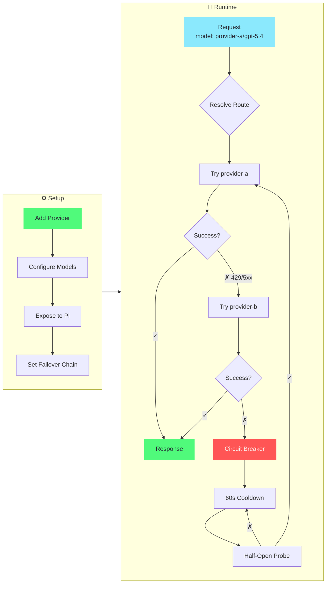

<div align="center">

# pi-switch

[](https://github.com/heihei0299/pi-switch/releases)
[](https://github.com/heihei0299/pi-switch/releases)
[](https://www.rust-lang.org/)
[](LICENSE)

**TUI + CLI dual-mode profile switcher for pi agent**

Manage provider profiles and run a local model-name routing gateway with failover — via an interactive TUI or CLI.

[English](#) | [中文](README_ZH.md)

</div>

---

## 📸 Screenshots

<div align="center">
  
</div>

---

## 📥 Installation

```bash
# npm (recommended)
npm install -g @heihei0299/pi-switch

# or via pi
pi install npm:@heihei0299/pi-switch
```

**Build from source** (requires Node.js >= 20, Rust 1.80+):

```bash
git clone https://github.com/heihei0299/pi-switch.git
cd pi-switch
npm install
npm run build:native
node bin/pi-switch.js tui
```

### System Compatibility

**Supported platforms:**
- ✅ Windows (x64)
- ✅ macOS (Intel & Apple Silicon)
- ✅ Linux (x64) - glibc & musl

**Linux users:** This package includes prebuilt binaries for both glibc and musl systems. If you encounter a GLIBC version error, the package will automatically fallback to the musl binary which has broader compatibility.

**Troubleshooting GLIBC errors:**
```bash
# If you see "GLIBC_X.XX not found", build from source:
npm install -g @heihei0299/pi-switch --build-from-source
```

---

## 🚀 Quick Start

```bash
pi-switch tui          # Interactive TUI (recommended)
pi-switch webui start --daemon  # Browser UI at http://127.0.0.1:43110 (background daemon)
pi-switch doctor       # Run environment diagnostics
```

> **Three ways, one core.** CLI, TUI, and WebUI are thin adapters over the same
> Rust core. See [WEBUI_GUIDE.md](./WEBUI_GUIDE.md) for the WebUI and how to keep
> the three interfaces in sync.

### Essential CLI Commands

```bash
# Provider management
pi-switch provider add <name> [--preset <id>] [--api-key <key>]
pi-switch provider list
pi-switch provider show <name>
pi-switch provider delete <name>
pi-switch provider expose <name> <model-ids...>    # Expose models to pi agent
pi-switch provider fetch-models <name>             # Fetch models from API

# Proxy (gateway)
pi-switch proxy failover <p1,p2,...>               # Same-model fallback chain
pi-switch proxy start --daemon                     # Start proxy daemon
pi-switch proxy status

# Package management
pi-switch package list                             # List installed packages
pi-switch package add <id> <name> <version>        # Add a new package
pi-switch package toggle <id>                      # Enable/disable package
pi-switch package remove <id>                      # Remove package
pi-switch package show <id>                        # Show package details

# WebUI (browser config) — always use --daemon so it runs in the
# background and can be stopped with `pi-switch webui stop`
pi-switch webui start --daemon [--host <ip>] [--port <port>]
pi-switch webui status
pi-switch webui stop

# Other
pi-switch presets list                             # List built-in presets
pi-switch config show                               # Display current config
pi-switch config backups                            # List backup files
pi-switch config export <passphrase>                # Encrypted export
pi-switch config import <path> <passphrase>         # Encrypted import
pi-switch import ccswitch [--path <db>] [--all] [--force]  # Import providers from cc-switch
pi-switch stats                                     # View request statistics
```

---

## ✨ Features

| Category | Highlights |
|----------|------------|
| 🔌 **Provider Management** | CRUD, duplicate, search/filter, model management, **multi-upstream** (`upstreams[]` with baseUrl/apiKey/headers/weight), expose to pi agent, configure Responses API passthrough/conversion mode |
| ⇥ **cc-switch Import** | One-click import of providers from cc-switch (Claude Code / Codex / Gemini), dedup by base URL, skip official presets — CLI, TUI, WebUI |
| 💡 **Built-in Presets** | OpenRouter, Anthropic, DeepSeek, SiliconFlow, OpenAI — add profiles instantly |
| 🌉 **Model-Name Gateway** | **Independent** process/plugin — Profiles only write local config, Gateway explicitly publishes to `~/.pi/agent/models.json` via `Current vs Proposed` preview & `Apply to Pi`; stateless routing by `profile/model`, SSE streaming, User-Agent disguise, OpenAI ↔ Anthropic & Responses ↔ Chat Completions, failover, circuit breaker |
| 🗂️ **Model Catalog** | Auto-enrich model metadata (cost/limit/reasoning/input) from https://models.dev with 24h cache, per-profile `modelsDevProvider` mapping & global fallback |
| 📦 **Package Management** | Install, enable/disable, and manage packages across CLI, TUI, and WebUI |
| 🖥️ **Interactive TUI** | ratatui-powered, Dracula theme, mouse support, vim keys (`hjkl`) |
| 🌐 **Bilingual** | English / 中文, persisted to config, toggle in Settings |
| 📊 **Usage Stats** | Per-provider, per-model request metrics & latency; four-dimension token totals (input/output/cached/reasoning), cache hit rate, time-window queries (today/24h/7d/custom), per-conversation breakdown |
| 💾 **Backup & Sync** | Auto-backup on mutation, AES-256-CBC encrypted export/import |
| 🩺 **Diagnostics** | `doctor` command checks config, models.json, structure |

---

## ⇥ Import from cc-switch

Already using [cc-switch](https://github.com/farion1231/cc-switch)? You can import its providers into pi-switch with one command instead of re-adding them by hand:

```bash
pi-switch import ccswitch                 # interactive selection
pi-switch import ccswitch --all           # import everything new
pi-switch import ccswitch --path /path/to/cc-switch.db   # custom db location
```

- Reads `~/.cc-switch/cc-switch.db` (SQLite, read-only — cc-switch is never modified)
- Maps the three common client types: **Claude** → `anthropic-messages`, **Codex** → `openai-responses`, **Gemini** → `google-generative-ai`
- Official presets (e.g. `claude-official`) are skipped
- **Dedup by base URL**: providers already in pi-switch are flagged as existing and skipped (use `--force` to overwrite)
- Name collisions resolve to `name (cc)` instead of silently overwriting
- If the default db path is missing, you are prompted for the path to `cc-switch.db` (or you can cancel)

Available in all three UIs: CLI (`pi-switch import ccswitch`), TUI (Profiles → `i`), WebUI (Profiles → *Import from cc-switch*).

---

## 📊 Usage Statistics

Every proxied request is appended to `~/.pi-switch/requests.log` as a JSON line. For streaming responses the upstream SSE stream is teed: each request's input/output/cached/reasoning token counts (when the upstream reports them) and conversation id are parsed on the side and the log line is written when the stream ends — the stream itself is never buffered. Reasoning tokens are a subset of output tokens (parsed from `completion_tokens_details.reasoning_tokens` / `output_tokens_details.reasoning_tokens` where the upstream reports them); they never inflate the total.

- **TUI Stats page** shows the cumulative input/output tokens and the cache hit rate.
- **Stats API** (`GET /api/stats`) returns `totalTokens` with four dimensions — input / output / cached / reasoning (`total = input + output`, reasoning is a subset of output) — plus `cacheHitRate`, per-provider and per-model token detail columns (input / output / cached / total / cache rate / cost), and `byConversation` — conversations sorted by most recent activity (top 20), with requests without an id merged into a single `unlabeled` group.
- **Time window** — the WebUI stats page has a time-range picker: **Today** (local calendar day from 00:00), **Last 24h** and **Last 7d** (rolling windows), and **Custom** (start day 00:00 → end day 24:00, both dates required). The default is Today. The picker converts the window to `from`/`to` epoch-millis and calls `GET /api/stats?range=<today|last24h|last7d|custom>&from=<ms>&to=<ms>`; a bare request with no window parameters returns the full history.
- **WebUI dashboard** — token totals render as five tiles (Input / Output / Cached / Reasoning / Total) with subset badges (`Cached ⊆ Input`, `Reasoning ⊆ Output`), and each conversation row adds Input / Output / Cached / Reasoning / cache hit rate / Total in a two-line layout when over-wide; missing or zero token values show `-`.
- **Request details** — below the conversation card, the stats page lists every request in the current window, newest first, capped at the most recent 100: time, provider, model, status (with error for failures), and input / output / cached / reasoning / total tokens plus per-request cache hit rate. Rows without reported usage show `-`, never a misleading zero. **Cache rates below 50% render in red**, and clicking a conversation cell copies the full conversation id to the clipboard.
- **Cache hit rate** = cached input tokens ÷ total input tokens (output tokens excluded). When no cache data exists it shows `-`, never a misleading `0%`.
- **Conversation id** comes from the client: `x-conversation-id` header first, `x-opencode-session` second (sent by pi/open-code clients), `conversation_id` body field as fallback (ADR-0002). Requests from spawned subagents fold into the parent conversation id, so background agents don't fragment the stats. The two opencode attribution headers (`x-opencode-session` / `x-opencode-client`) are injected by the pi-side conversation-id-inject extension; set `settings.injectOpenCodeAttribution: false` in `~/.pi-switch/config.json` (or uncheck it in the WebUI Settings panel) and restart pi to stop the extension from sending them (pi core itself still injects them for direct opencode/opencode-go connections; through the pi-switch proxy it does not).
- **Conversation name** — the injected `x-conversation-name` is the session's explicit title, or falls back to the first user message as a readable label. Non-Latin1 titles are percent-encoded on the wire so the header stays HTTP-safe, then decoded back by the proxy and again defensively by the webui, so Chinese titles render readably in the dashboard (legacy pre-decode log rows are decoded at display time too). Pi's skill-injection messages (`<skill name="…">`) are skipped when picking the fallback title, so the label is the user's own first message, never the injected tag.
- Only successful requests with reported usage count towards token totals; failover/retry intermediate rows and old log lines without token fields are excluded gracefully, so upgrading never breaks or blanks existing history.

---

## 🎯 Core Workflow

### Gateway Routing & Failover



### Step by Step

**1. Add a provider** (CLI or TUI)
```bash
pi-switch provider add provider-a --api openai-completions --base-url https://api.example.com/v1 \
    --api-key '$API_KEY' --models gpt-5.4,claude-sonnet-4-5
```
In TUI: `Profiles → a → fill form → Ctrl+S`

**2. Expose models to pi agent** — choose which models appear in `~/.pi/agent/models.json` (local only)
```bash
pi-switch provider expose provider-a gpt-5.4
```
In TUI/WebUI: `Profiles → select provider → x` (does not yet write `models.json`)

**2.5 Publish to Pi** — Gateway explicitly writes the aggregated provider
```bash
# WebUI: Gateway → Current vs Proposed → Apply to Pi
# or via API: PUT /api/models/gateway
```
In WebUI: `Gateway → Apply to Pi` (shows pending diff, supports rollback)

**3. Start the proxy** — it reads the published `pi-switch` gateway provider
```bash
pi-switch proxy failover provider-b,provider-c          # optional same-model fallback
pi-switch proxy start --daemon
```

**4. Use in pi** — select the `pi-switch` provider, then pick a `profile/model` like `provider-a/gpt-5.4`

### How Gateway Routing Works

Requests are routed by the model name in the request body — no out-of-band state, no "current target":

- **Model-name routing** — `"model": "provider-a/gpt-5.4"` resolves to profile `provider-a`, real model `gpt-5.4`; the proxy rewrites the body before forwarding upstream
- **Single gateway provider** — pi sees one `pi-switch` provider advertising every exposed model as `profile/realModelId`; switching model in pi = sending a different model string = instant routing change
- **Automatic failover** — same-model fallback across the configured chain on 429/5xx errors or network failures
- **Circuit breaker** — after 3 consecutive failures, provider enters 60s cooldown; auto-recovery on half-open probe success
- **Streaming (SSE)** — same-format requests (openai→openai, anthropic→anthropic) stream token-by-token; upstream response headers (Content-Type, etc.) are preserved
- **OpenAI ↔ Anthropic** — transparently converts between chat completions and messages APIs
- **User-Agent disguise** — built-in presets (Claude Code / Codex / Gemini) send the matching client's real User-Agent (and headers like `anthropic-beta`) to pass upstream client checks; settable globally or per-profile

> **Known limitation** — the OpenAI ↔ Anthropic **conversion** path can't stream: it parses the full JSON to convert formats. If pi sends `stream: true` but the model routes to a cross-format upstream (OpenAI request → Anthropic upstream, or vice-versa), the reply comes back as a single non-streamed response. Same-format routes stream normally.

---

## 🏗️ Architecture

```
pi-switch/
├── bin/pi-switch.js         # CLI entry point
├── index.js                 # ESM wrapper for native addon
├── pi-switch-native.cjs     # NAPI loader (auto platform detection)
├── src-rust/                # Rust native core (napi-rs)
│   ├── lib.rs               # NAPI function exports
│   ├── config.rs            # Config load/save, types (ProviderProfile + Upstream)
│   ├── ops.rs               # Core operations (provider CRUD)
│   ├── gateway.rs           # Independent gateway (models.json sync, preview/apply, atomic write)
│   ├── presets.rs           # Built-in provider presets
│   ├── proxy.rs             # Proxy server (gateway routing, failover, circuit breaker)
│   ├── daemon.rs            # Daemon lifecycle
│   ├── ccswitch.rs          # cc-switch provider import
│   ├── database.rs          # SQLite persistence
│   ├── package_ops.rs       # Package management
│   ├── service.rs           # Shared service layer
│   ├── web.rs               # WebUI HTTP server (profiles/gateway split routers)
│   ├── credits.rs           # 供应商余量代理与归一化（CreditsFetcher/OpencodeGoFetcher，5s 超时，主上游，不写盘）
│   ├── stats.rs             # Request log aggregation + token usage stats
│   ├── usage.rs             # Token usage extraction & SSE stream parsing
│   ├── sync.rs              # Encrypted export/import
│   └── tui/                 # Interactive terminal UI (ratatui)
│       ├── app.rs           # State machine + key handler
│       ├── form.rs          # Provider form state
│       ├── i18n.rs          # Bilingual (EN/ZH)
│       └── ui/              # Rendering (chrome, pages, overlays)
├── src/                     # JavaScript layer (pi extension support)
├── extensions/index.ts      # Pi agent extension (/piswitch)
└── Cargo.toml
```

**Config files:**
- `~/.pi-switch/config.json` — profiles, proxy settings, failover chain
- `~/.pi-switch/requests.log` — per-request JSON log (status, latency, token usage, conversation id)
- `~/.pi-switch/backups/` — timestamped auto-backups on every mutation
- `~/.pi/agent/models.json` — pi's provider registry (pi-switch writes a single gateway provider)

---

## ❓ FAQ

<details>
<summary><b>How do I switch models in pi?</b></summary>
<br>

In pi, open `/model` and pick any advertised `profile/model` (e.g. `provider-a/gpt-5.4`). The proxy routes by the model name in each request — no extra step needed.

To add more models, expose them in TUI (`Profiles → select provider → x`) or via CLI:
```bash
pi-switch provider expose <name> <model-id>...
```

</details>

<details>
<summary><b>How do I set up failover?</b></summary>
<br>

In TUI: `Settings → Failover` → `Enter` → enter comma-separated profile names → `Enter`.
Or via CLI:
```bash
pi-switch proxy failover provider-b,provider-c
```

Profiles in the failover chain that expose the same model are tried in order when the primary fails.

</details>

<details>
<summary><b>What does the [proxy] badge mean?</b></summary>

<br>

The `[proxy]` badge indicates this profile is a meta-profile (with `"proxy": true`). Proxy profiles are used to register a pi provider that points to the local gateway. They are excluded from upstream routing.

In the current gateway mode, proxy profiles are typically not needed — the proxy reads the published `pi-switch` gateway provider from `~/.pi/agent/models.json` (publish explicitly via **Gateway → Apply to Pi**, not automatically on startup).

</details>

<details>
<summary><b>How does gateway routing work?</b></summary>

<br>

The proxy advertises every exposed model as `profile/realModelId` under a single `pi-switch` provider. When pi sends a request with `"model": "provider-a/gpt-5.4"`, the proxy:

1. Splits on the first `/` — profile `provider-a`, real model `gpt-5.4`
2. Routes to the `provider-a` profile's upstream, rewriting `body.model` to `gpt-5.4`
3. On failure (429/5xx), tries the failover chain for any other profile exposing `gpt-5.4`

```bash
# 1. Expose models (per profile)
pi-switch provider expose provider-a gpt-5.4
pi-switch provider expose provider-b gpt-5.4

# 2. Set failover chain (optional)
pi-switch proxy failover provider-b

# 3. Start proxy daemon
pi-switch proxy start --daemon
```

In pi, select the `pi-switch` provider, then `provider-a/gpt-5.4`. The model name in each request determines the route — no "target" to manage.

</details>

<details>
<summary><b>Pi errors with `unknown variant 'developer'` (400) for reasoning models?</b></summary>

<br>

**Problem** — pi sends the OpenAI `developer` role (the 2025 recommendation) for models marked `reasoning: true`. Some upstream gateways only accept `system` / `user` / `assistant` / `tool` (e.g. opencode zen) and reject the request:

```
400: messages[0].role: unknown variant `developer`, expected one of `system`, `user`, `assistant`, `tool`
```

**Fix — edit pi's config `~/.pi/agent/models.json`**: on each offending model of the `pi-switch` provider, add `"compat": { "supportsDeveloperRole": false }` — pi then sends the `system` role while keeping thinking features:

```json
{
  "id": "opencode-go/deepseek-v4-flash",
  "reasoning": true,
  "compat": { "supportsDeveloperRole": false }
}
```

**Note** — the next web/CLI sync rebuilds the `pi-switch` provider entry and wipes manual edits to `models.json`. To survive syncs, put the same `compat` on the model entry inside `~/.pi-switch/config.json` (profile → `models`, id without the `profile/` prefix) instead — sync passes it through verbatim.

Reference — `pi-switch` provider entry with an opencode upstream (sanitized example):

```json
{
  "pi-switch": {
    "api": "openai-completions",
    "apiKey": "pi-switch-proxy",
    "baseUrl": "http://127.0.0.1:43112/v1",
    "models": [
      {
        "compat": { "requiresReasoningContentOnAssistantMessages": true, "supportsDeveloperRole": false, "supportsLongCacheRetention": true, "thinkingFormat": "deepseek" },
        "contextWindow": 1000000,
        "cost": { "cacheRead": 0.0028, "cacheWrite": 0.0, "input": 0.14, "output": 0.28 },
        "id": "opencode-go/deepseek-v4-flash",
        "input": ["text"],
        "maxTokens": 384000,
        "name": "DeepSeek V4 Flash",
        "reasoning": true,
        "thinkingLevelMap": { "xhigh": "max" }
      },
      {
        "compat": { "requiresReasoningContentOnAssistantMessages": true, "supportsDeveloperRole": false, "supportsLongCacheRetention": true, "thinkingFormat": "deepseek" },
        "contextWindow": 1000000,
        "cost": { "cacheRead": 0.0145, "cacheWrite": 0.0, "input": 1.74, "output": 3.48 },
        "id": "opencode-go/deepseek-v4-pro",
        "input": ["text"],
        "maxTokens": 384000,
        "name": "DeepSeek V4 Pro",
        "reasoning": true,
        "thinkingLevelMap": { "xhigh": "max" }
      },
      {
        "contextWindow": 1000000,
        "cost": { "cacheRead": 0.08, "cacheWrite": 0.0, "input": 0.4, "output": 2.0 },
        "id": "opencode-go/mimo-v2.5",
        "input": ["text", "image"],
        "maxTokens": 1000000,
        "name": "MiMo V2.5",
        "reasoning": true
      }
    ],
    "proxy": false
  }
}
```
</details>

<details>
<summary><b>How does User-Agent disguise work?</b></summary>
<br>

Some upstream channels only accept requests from whitelisted clients (checking the User-Agent name prefix). pi-switch has three built-in presets that send the matching client's real identity:

| Preset | User-Agent | Extra headers |
|--------|------------|---------------|
| Claude Code | `claude-cli/2.1.161 (external, cli)` | `anthropic-version`, `anthropic-beta` |
| Codex | `codex_cli_rs/0.1.0` | — |
| Gemini | `gemini-cli/0.1.5` | `x-goog-api-client` |

- **Global**: `Settings → User-Agent`, cycle with `←/→`.
- **Per-profile**: in a profile's detail view press `u` to cycle; a per-profile value overrides the global one. Useful when only some upstreams enforce a UA whitelist.

Note: this only passes checks that look at the client name. It does not fabricate deeper per-request tokens (turn state, session ids), which strict first-party endpoints validate.

</details>

<details>
<summary><b>Where is my data stored?</b></summary>
<br>

Everything under `~/.pi-switch/`. Pi's own registry is `~/.pi/agent/models.json`. No data leaves your machine.

</details>

---

## 🛠️ Development

```bash
npm run build:native:debug     # Build Rust addon (debug)
npm run build:native           # Build Rust addon (release)
cargo build                    # Rust-only build
cargo clippy                   # Lint
cargo fmt                      # Format
cargo test --release --lib     # Run unit tests
```

**Note:** Stop the TUI/daemon before `npm run build:native` to avoid file-lock errors on Windows.

---

## 🙏 Acknowledgments

- **[cc-switch](https://github.com/farion1231/cc-switch)** — the original TUI-based profile switcher for Claude Code, which pioneered the interactive terminal UI pattern and proxy failover design
- **[cc-switch-cli](https://github.com/SaladDay/cc-switch-cli)** — the CLI counterpart, providing a clean command-line interface for provider management

Thanks also to the **[LINUX DO](https://linux.do/)** community for the discussions that sparked this project.

---

## 📜 License

MIT
