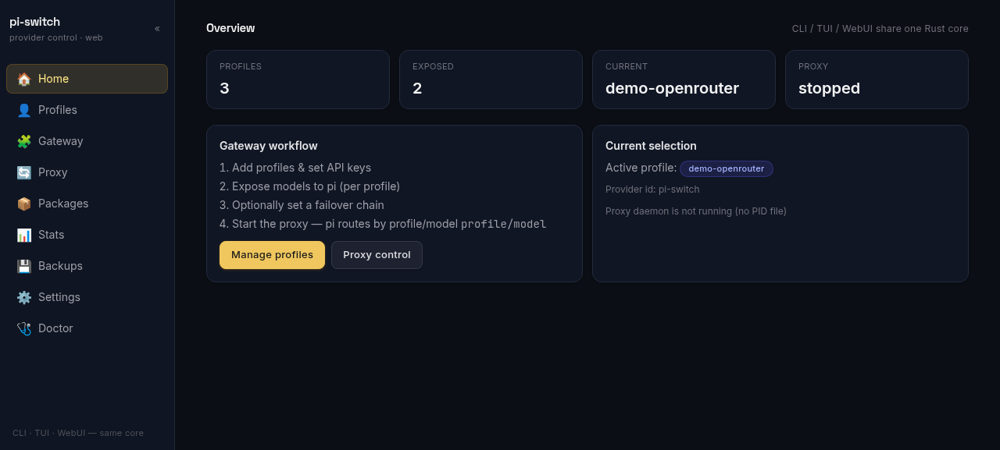
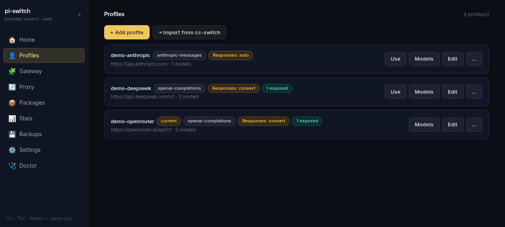
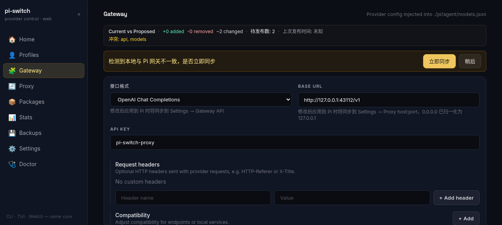
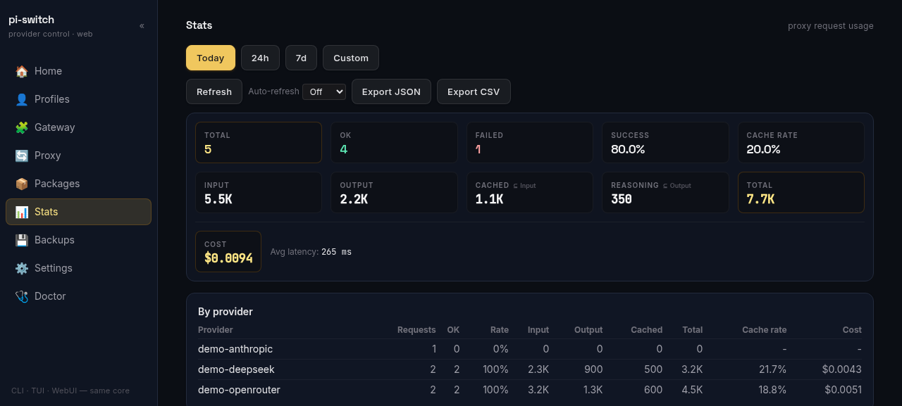

# pi-switch

**A WebUI-first control plane for pi agent.**

Manage provider profiles and publish a local model-name gateway, with CLI and TUI options for terminal workflows.

[English](#) | [中文](README_ZH.md)

---

## Screenshots

 

---

## What it does

- Manage provider profiles, model lists, and per-channel model exposure.
- Preview and publish models to Pi through the Gateway page.
- Route requests through a local proxy using the model name.
- View request and token usage, and manage pi packages from the WebUI.
- Use the same Go core through the WebUI, CLI, or TUI.

For architecture and detailed behavior, see [WEBUI_GUIDE.md](./WEBUI_GUIDE.md), [docs/architecture.md](./docs/architecture.md), and [docs/system-contract.md](./docs/system-contract.md).

## Install

### From npm

~~~bash
npm install -g @heihei0299/pi-switch

# Or install through pi
pi install npm:@heihei0299/pi-switch
~~~

### Build from source

Requires Node.js 23.6 or later and Go 1.24.2 or later.

~~~bash
git clone https://github.com/heihei0299/pi-switch.git
cd pi-switch
npm install
npm run build
node bin/pi-switch.js webui start --daemon
~~~

New CLI/npm versions support Linux amd64 and arm64 only. macOS and Windows are unsupported; historical releases are unchanged. See [releases](https://github.com/heihei0299/pi-switch/releases) for available downloads.

## Quick start

Start the browser UI and open <http://127.0.0.1:43110>:

~~~bash
pi-switch webui start --daemon
~~~

Run environment checks with <code>pi-switch doctor</code>. Stop the UI with <code>pi-switch webui stop</code>. The terminal interfaces are also available: <code>pi-switch tui</code> or other <code>pi-switch</code> commands.

### Use a model in Pi

1. Add a provider and expose its models in **Profiles**.
2. In **Gateway**, review the proposed changes and select **Apply to Pi**.
3. Start the proxy from **Proxy**, or run <code>pi-switch proxy start --daemon</code>.
4. In Pi, select <code>pi-switch-res</code> for Responses models or <code>pi-switch-chat</code> for Chat models, then choose an exposed model.

The WebUI binds to loopback by default. Binding to a non-loopback address requires a password; see the [security guide](./WEBUI_GUIDE.md#security).

## Common questions

**How do I switch models in Pi?**

Open <code>/model</code>, select the published <code>pi-switch-res</code> or <code>pi-switch-chat</code> provider, and choose an exposed model.

**Where is data stored?**

Configuration and local request data are stored under <code>~/.pi-switch/</code>. Pi's provider registry is <code>~/.pi/agent/models.json</code>.

## Development

Requires Node.js 23.6 or later and Go 1.24.2 or later.

~~~bash
npm install
npm run build
bash scripts/test-limited.sh
npm run test:webui
~~~

## Acknowledgments

- [cc-switch](https://github.com/farion1231/cc-switch) and [cc-switch-cli](https://github.com/SaladDay/cc-switch-cli) for the profile-management and terminal UI ideas.
- The [LINUX DO](https://linux.do/) community for the discussions that inspired the project.

## License

MIT
