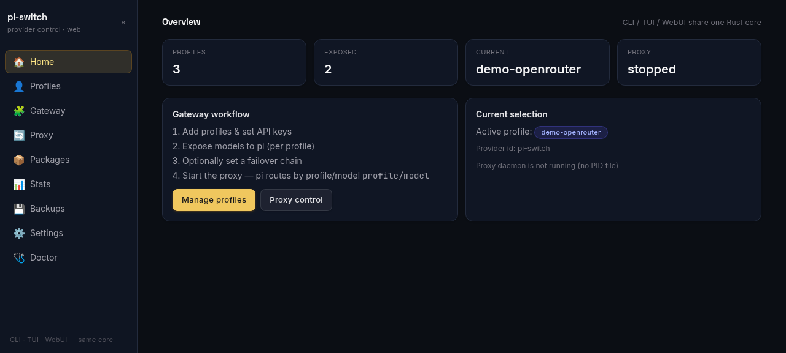
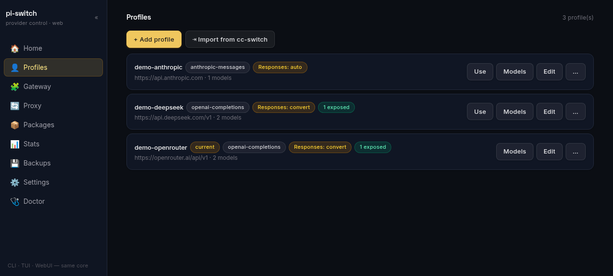
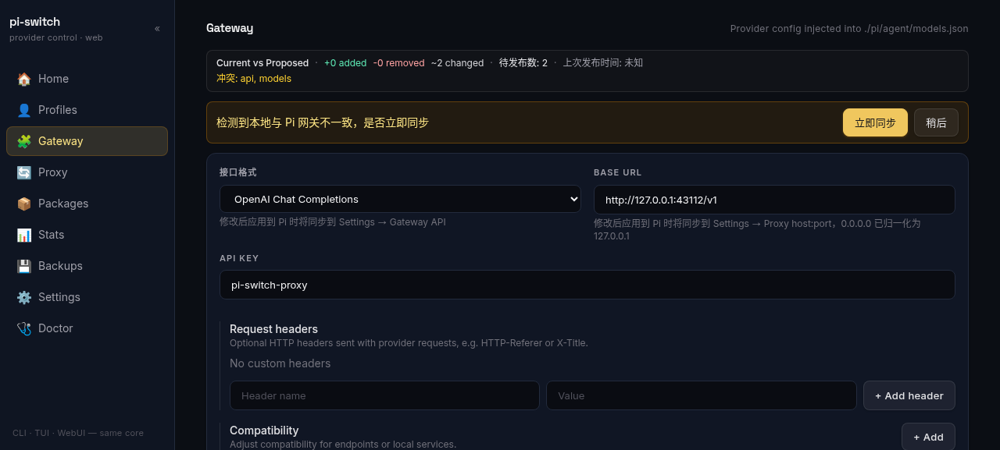
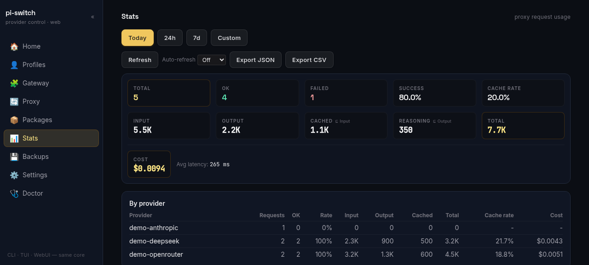
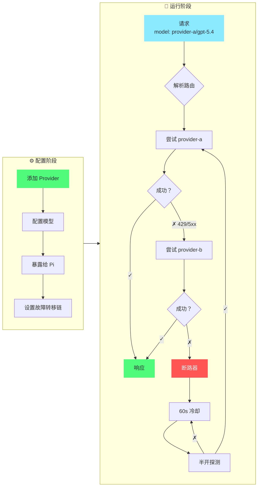

<div align="center">

# pi-switch

[](https://github.com/heihei0299/pi-switch/releases)
[](https://github.com/heihei0299/pi-switch/releases)
[](https://www.rust-lang.org/)
[](LICENSE)

**WebUI 优先的 pi agent 控制面板**

通过浏览器优先的 WebUI 管理 provider 配置、运行本地模型名路由网关 — CLI 与 TUI 复用同一套 Rust 核心。

[English](README.md) | [中文](#)

</div>

---

## 📸 截图 — WebUI

<div align="center">



<br/>



<br/>
<sub>Home · Profiles · Gateway（Current vs Proposed）· Stats — 深色主题 1280×800。TUI 仍可用：<code>assets/main.png</code></sub>
</div>

---

## 📥 安装

```bash
# npm（推荐）
npm install -g @heihei0299/pi-switch

# 或通过 pi 安装
pi install npm:@heihei0299/pi-switch
```

**从源码构建**（需要 Node.js >= 20, Rust 1.80+）：

```bash
git clone https://github.com/heihei0299/pi-switch.git
cd pi-switch
npm install
npm run build              # 构建 webui/dist 并嵌入到 .node
# 或分步：
# npm run build:webui      # vite 构建 → webui/dist
# npm run build:native     # napi build --release（嵌入 webui/dist）
node bin/pi-switch.js webui start --daemon
# 打开 http://127.0.0.1:43110
```

### 系统兼容性

**支持的平台：**
- ✅ Windows (x64)
- ✅ macOS (Intel 与 Apple Silicon)
- ✅ Linux (x64) - glibc 和 musl

**Linux 用户：** 本包包含了 glibc 和 musl 两种预编译二进制文件。如果遇到 GLIBC 版本错误，包会自动回退到兼容性更广的 musl 版本。

**GLIBC 错误排查：**
```bash
# 如果看到 "GLIBC_X.XX not found" 错误，可从源码构建：
npm install -g @heihei0299/pi-switch --build-from-source
```

---

## 🚀 快速开始 — WebUI 优先

```bash
pi-switch webui start --daemon  # 浏览器界面 http://127.0.0.1:43110（推荐）
pi-switch tui                   # 交互式 TUI（备选）
pi-switch doctor                # 运行环境诊断
```

> **WebUI 是主界面。** CLI、TUI、WebUI 都是同一套 Rust 核心之上的薄适配层。
> WebUI 在浏览器中覆盖 Profiles、Gateway、Proxy、Stats、Settings 等全部能力；
> TUI 与 CLI 为终端工作流提供同等操作。
> 架构、新增操作的 4 步 recipe 与完整 REST ↔ 核心映射见 [WEBUI_GUIDE.md](./WEBUI_GUIDE.md)。

### 常用命令 — CLI 与 WebUI 对照

```bash
# Provider 管理（CLI）
pi-switch provider add <名称> [--preset <id>] [--api-key <key>]
pi-switch provider list
pi-switch provider show <名称>
pi-switch provider delete <名称>
pi-switch provider expose <名称> <model-ids...>    # 暴露模型到 pi agent
pi-switch provider fetch-models <名称>             # 从 API 抓取模型列表

# WebUI：Profiles → + Add profile / Import from cc-switch → Edit → Expose

# 代理（网关）
pi-switch proxy failover <p1,p2,...>               # 同模型故障转移链
pi-switch proxy start --daemon                     # 启动代理守护进程
pi-switch proxy status

# WebUI：Gateway → Current vs Proposed → Apply to Pi， Proxy → Start/Stop

# Package 管理
pi-switch package list                             # 列出已安装的包
pi-switch package add <id> <名称> <版本>            # 添加新包
pi-switch package toggle <id>                      # 启用/禁用包
pi-switch package remove <id>                      # 删除包
pi-switch package show <id>                        # 显示包详情

# WebUI：Packages → Add / Toggle / Remove

# WebUI（浏览器配置）——建议始终使用 --daemon 后台运行，
# 这样可以用 `pi-switch webui stop` 停止
pi-switch webui start --daemon [--host <ip>] [--port <端口>]
pi-switch webui status
pi-switch webui stop

# 其他
pi-switch presets list                             # 列出内置预设
pi-switch config show                               # 显示当前配置
pi-switch config backups                            # 列出备份文件
pi-switch config export <密码>                      # 加密导出
pi-switch config import <路径> <密码>                # 加密导入
pi-switch import ccswitch [--path <db>] [--all] [--force]  # 从 cc-switch 导入 provider
pi-switch stats                                     # 查看请求统计
```

---

## ✨ 功能特性

| 分类 | 亮点 |
|------|------|
| 🌐 **WebUI（主界面）** | 浏览器控制面板 `http://127.0.0.1:43110` — Profiles 增删改查、Gateway `Current vs Proposed` 差异与 `Apply to Pi`、Proxy 启停、Stats 仪表（时间窗口/自动刷新）、Packages、Settings、Doctor。Daemon 托管（独立 pid/log/port），本地回环免认证、非回环 Basic 认证。 |
| 🔌 **Provider 管理** | 增删改查、复制、搜索/过滤、模型管理、暴露到 pi agent、配置 Responses API 透传/转换模式 |
| ⇥ **cc-switch 导入** | 一键从 cc-switch（Claude Code / Codex / Gemini）导入 provider，按 baseUrl 去重、跳过官方预置项 — CLI、TUI、WebUI 三端支持 |
| 💡 **内置预设** | OpenRouter、Anthropic、DeepSeek、SiliconFlow、OpenAI — 一键创建配置 |
| 🌉 **模型名网关** | 无状态按 `profile/model` 路由、SSE 流式、User-Agent 伪装、请求体过滤、OpenAI ↔ Anthropic 转换、Responses ↔ Chat Completions 转换（含 function tools）、原生 OpenAI Responses 透传、故障转移、断路器 |
| 🗂️ **模型目录** | 从 https://models.dev 自动补齐模型元数据（cost/limit/reasoning/input），24h 缓存、按 profile 的 `modelsDevProvider` 映射与全局回退 |
| 📦 **Package 管理** | 在 CLI、TUI、WebUI 中安装、启用/禁用和管理包 |
| 🖥️ **TUI（次要）** | ratatui 驱动、Dracula 主题、鼠标支持、vim 键位 (`hjkl`) — 与 WebUI/CLI 全量对齐的终端备选 |
| 🌐 **双语支持** | English / 中文，持久化到配置，Settings 中切换 |
| 📊 **使用统计** | 按 provider、按模型的请求指标与延迟；四维度 token 总量（输入/输出/缓存/推理）、缓存命中率、时间窗口查询（当天/24h/7 天/自定义）、按对话统计 — 数据模型见 [WEBUI_GUIDE.md](./WEBUI_GUIDE.md) |
| 💾 **备份与同步** | 每次修改自动备份、AES-256-CBC 加密导出/导入 |
| 🩺 **诊断工具** | `doctor` 命令检查配置、models.json、结构完整性 |

---

## ⇥ 从 cc-switch 导入

已经在用 [cc-switch](https://github.com/farion1231/cc-switch)？一条命令即可把它的 provider 导入 pi-switch，无需手动重新添加：

```bash
pi-switch import ccswitch                 # 交互式选择
pi-switch import ccswitch --all           # 导入全部新 provider
pi-switch import ccswitch --path /路径/cc-switch.db   # 自定义数据库路径
```

- 读取 `~/.cc-switch/cc-switch.db`（SQLite，只读 — 不修改 cc-switch 数据）
- 映射三种常用客户端：**Claude** → `anthropic-messages`、**Codex** → `openai-responses`、**Gemini** → `google-generative-ai`
- 跳过官方预置项（如 `claude-official`）
- **按 baseUrl 去重**：pi-switch 已有的 provider 标记为已存在并跳过（`--force` 可覆盖）
- 同名冲突自动加 `(cc)` 后缀，不静默覆盖
- 默认路径找不到时会提示输入 `cc-switch.db` 的路径（或取消）

三端均支持：CLI（`pi-switch import ccswitch`）、TUI（Profiles → `i`）、WebUI（Profiles → *Import from cc-switch*）。

---

## 📊 使用统计

每次代理请求都会以 JSON 行追加写入 `~/.pi-switch/requests.log`。流式响应通过 tee 旁路解析：请求的输入/输出/命中缓存/推理 token 数（上游上报时）与对话标识在流结束后补写进日志——流本身从不缓冲，逐 token 体验不变。推理 token 是输出 token 的子集（解析自上游上报的 `completion_tokens_details.reasoning_tokens` / `output_tokens_details.reasoning_tokens`），不计入总量。

- **WebUI 统计页**：token 总量平铺 5 格（输入/输出/缓存/推理/合计）并带子集角标（`Cached ⊆ Input`、`Reasoning ⊆ Output`）；`By provider` / `By conversation` 表格、时间范围选择器（当天 / 24 小时 / 7 天 / 自定义）、自动刷新档位（Off / 5s / 30s / 5min）与分页的请求明细。
- **统计接口**（`GET /api/stats`）：返回 `totalTokens` 四维度——输入/输出/缓存/推理（`total = 输入 + 输出`，推理是输出的子集）——以及 `cacheHitRate`、按供应商与按模型的 token 明细与 `byConversation`。
- 完整数据模型、窗口语义与日志 schema 见 [WEBUI_GUIDE.md](./WEBUI_GUIDE.md) 与 `stats.rs` / `usage.rs` 模块 — README 仅保留概览以保持轻量。

---

## 🎯 核心流程

### 网关路由与故障转移



### 操作步骤 — WebUI 优先

**1. 添加 provider** — WebUI：`Profiles → + Add profile → 填写表单 → Save`；或 CLI：

```bash
pi-switch provider add provider-a --api openai-completions --base-url https://api.example.com/v1 \
    --api-key '$API_KEY' --models gpt-5.4,claude-sonnet-4-5
```

_TUI：`Profiles → a → 填写表单 → Ctrl+S` 仍作为终端备选。_

**2. 暴露模型到 pi agent** — WebUI：`Profiles → 选择 provider → Models → 勾选 → Save`（仅写 `~/.pi-switch/config.json`）；或 CLI：

```bash
pi-switch provider expose provider-a gpt-5.4
```

**2.5 发布到 Pi** — WebUI：`Gateway → Current vs Proposed → Apply to Pi`（显式发布，展示差异并支持回滚）；或 `PUT /api/models/gateway`。供应商与网关隔离保证 Profiles 的修改不会自动覆写 `~/.pi/agent/models.json`，必须显式发布。

**3. 启动代理** — 读取已发布的 `pi-switch` 网关 provider：

```bash
pi-switch proxy failover provider-b,provider-c          # 可选：同模型故障转移
pi-switch proxy start --daemon
```

_WebUI：`Proxy → Start`（同一 daemon，状态在 WebUI 中展示）_

**4. 在 pi 中使用** — 选择 `pi-switch` provider，然后选 `provider-a/gpt-5.4` 这样的模型

### 网关路由原理

请求按 body 中的模型名路由 — 无需额外状态，没有"当前目标"概念：

- **模型名路由** — `"model": "provider-a/gpt-5.4"` 解析为 profile `provider-a`、真实模型 `gpt-5.4`；转发前代理将 body.model 改回真实 ID
- **单个网关 provider** — pi 只看到一个 `pi-switch` provider，下面列出所有暴露模型（格式 `profile/真实模型ID`）；在 pi 中切换模型 = 发送不同的 model 字符串 = 即时路由切换
- **自动故障转移** — 429/5xx 或网络错误时，按配置链进行同模型 fallback
- **断路器保护** — 连续 3 次失败后进入 60s 冷却，半开探测成功后自动恢复
- **流式（SSE）** — 同格式请求（openai→openai、anthropic→anthropic）逐字流式转发；保留上游响应头（Content-Type 等）
- **OpenAI ↔ Anthropic** — 自动在 chat completions 和 messages API 间转换
- **User-Agent 伪装** — 内置 Claude Code / Codex / Gemini 预设，发送对应客户端的真实 User-Agent（及 `anthropic-beta` 等头）以通过上游客户端校验；支持全局或按 profile 设置

> **已知限制** — OpenAI ↔ Anthropic **转换**路径无法流式：它需要解析完整 JSON 来转换格式。如果 pi 发 `stream: true` 但模型路由到跨格式上游（OpenAI 请求 → Anthropic 上游，或反之），响应会以单次非流式返回。同格式路由正常流式。

---

## 🏗️ 架构

```
pi-switch/
├── bin/pi-switch.js         # CLI 入口
├── index.js                 # ESM 包装器，用于原生插件
├── pi-switch-native.cjs     # NAPI 加载器（自动平台检测）
├── webui/                   # React 前端（Vite + Tailwind，通过 rust-embed 嵌入）
│   ├── src/components/      # Home, Profiles, Gateway, Proxy, Stats 等
│   └── dist/                # vite 构建产物（release 时烘焙进 .node）
├── src-rust/                # Rust 原生核心（napi-rs）
│   ├── lib.rs               # NAPI 函数导出
│   ├── config.rs            # 配置加载/保存、类型
│   ├── ops.rs               # 核心操作
│   ├── presets.rs           # 内置 provider 预设
│   ├── proxy.rs             # 代理服务器（网关路由、故障转移、断路器）
│   ├── daemon.rs            # 守护进程管理
│   ├── ccswitch.rs          # cc-switch provider 导入
│   ├── database.rs          # SQLite 持久化
│   ├── package_ops.rs       # 包管理
│   ├── service.rs           # 共享服务层
│   ├── web.rs               # WebUI HTTP 服务
│   ├── credits.rs           # 供应商余量代理与归一化（CreditsFetcher/OpencodeGoFetcher，5s 超时，主上游，不写盘）
│   ├── stats.rs             # 请求日志聚合 + token 统计
│   ├── usage.rs             # Token 使用量提取 & SSE 流解析
│   ├── sync.rs              # 加密导出/导入
│   └── tui/                 # 交互式终端 UI（ratatui）— 次要界面
│       ├── app.rs           # 状态机 + 按键处理
│       ├── form.rs          # Provider 表单
│       ├── i18n.rs          # 双语（EN/ZH）
│       └── ui/              # 渲染（chrome, pages, overlays）
├── src/                     # JavaScript 层（pi 扩展支持）
├── extensions/index.ts      # Pi agent 扩展（/piswitch）
└── Cargo.toml
```

**配置文件：**
- `~/.pi-switch/config.json` — profiles、代理设置、故障转移链
- `~/.pi-switch/requests.log` — 每次请求的 JSON 日志（状态、延迟、token 使用量、对话标识）
- `~/.pi-switch/backups/` — 每次修改自动生成带时间戳的备份
- `~/.pi/agent/models.json` — pi 的 provider 注册表（pi-switch 写入单个网关 provider）

WebUI 的薄适配层架构、新增操作的 4 步 recipe 与 REST ↔ 核心映射见 [WEBUI_GUIDE.md](./WEBUI_GUIDE.md) — 该指南是厚参考，本 README 保持轻量。

---

## ❓ 常见问题

<details>
<summary><b>如何在 pi 中切换模型？</b></summary>
<br>

在 pi 中打开 `/model`，选择任意 `profile/model`（如 `provider-a/gpt-5.4`）。代理按每个请求的模型名路由 — 无需额外操作。

要添加更多模型，在 WebUI 中暴露（`Profiles → 选择 provider → Models`）或使用 CLI：
```bash
pi-switch provider expose <名称> <model-id>...
```

</details>

<details>
<summary><b>如何设置故障转移？</b></summary>
<br>

WebUI 中：`Gateway` / `Proxy` 面板展示并编辑故障转移链（或 TUI：`Settings → Failover` → `Enter` → 输入逗号分隔的名称 → `Enter`）。
或使用 CLI：
```bash
pi-switch proxy failover provider-b,provider-c
```

暴露了相同模型的 failover 链中的 provider 会在主 provider 失败时按顺序尝试。

</details>

<details>
<summary><b>[proxy] 徽章是什么意思？</b></summary>
<br>

`[proxy]` 徽章表示该 profile 是一个元 profile（`"proxy": true`），用于在 pi 中注册指向本地网关的 provider，不参与上游路由。

在当前的网关模式下，通常不需要 proxy profile — 代理读取已发布的 `pi-switch` 网关 provider（路径 `~/.pi/agent/models.json`，需通过 **Gateway → 应用到 Pi** 显式发布，启动时不再自动写）。

</details>

<details>
<summary><b>网关路由如何工作？</b></summary>
<br>

代理在一个 `pi-switch` provider 下以 `profile/真实模型ID` 格式列出所有暴露模型。当 pi 发送 `"model": "provider-a/gpt-5.4"` 的请求时：

1. 按第一个 `/` 拆分 — profile `provider-a`，真实模型 `gpt-5.4`
2. 路由到 `provider-a` profile 的上游，将 `body.model` 改为 `gpt-5.4`
3. 失败（429/5xx）时，在 failover 链中寻找其他暴露了 `gpt-5.4` 的 profile

```bash
# 1. 暴露模型（按 profile）
pi-switch provider expose provider-a gpt-5.4
pi-switch provider expose provider-b gpt-5.4

# 2. 设置故障转移链（可选）
pi-switch proxy failover provider-b

# 3. 启动代理守护进程
pi-switch proxy start --daemon
```

在 pi 中选择 `pi-switch` provider，然后选 `provider-a/gpt-5.4`。每个请求的模型名决定路由 — 不需要管理"target"。

</details>

<details>
<summary><b>reasoning 模型报错 `unknown variant 'developer'`（400）？</b></summary>
<br>

**问题** — pi 对标记了 `reasoning: true` 的模型默认使用 OpenAI 的 `developer` role（2025 新推荐项）。部分上游网关的 schema 只接受 `system` / `user` / `assistant` / `tool`（如 opencode zen），直接拒绝请求：

```
400: messages[0].role: unknown variant `developer`, expected one of `system`, `user`, `assistant`, `tool`
```

**修复 — 修改 pi 的配置文件 `~/.pi/agent/models.json`**：在 `pi-switch` provider 下每个报错模型条目上加 `"compat": { "supportsDeveloperRole": false }`，pi 会改用 `system` role 发送，思考功能保留：

```json
{
  "id": "opencode-go/deepseek-v4-flash",
  "reasoning": true,
  "compat": { "supportsDeveloperRole": false }
}
```

**注意** — 下次网页/CLI sync 会重建 `pi-switch` provider 条目，抹掉对 models.json 的手动修改。想持久化，把同样的 compat 写进 `~/.pi-switch/config.json` 对应 profile 的 models 条目（id 不带 `profile/` 前缀）即可——sync 会原样透传。

参考 — opencode 上游的 `pi-switch` provider 条目（脱敏示例）：

```json
{
  "pi-switch": {
    "api": "openai-completions",
    "apiKey": "pi-switch-proxy",
    "baseUrl": "http://127.0.0.1:43112/v1",
    "models": [
      {
        "compat": { "requiresReasoningContentOnAssistantMessages": true, "supportsDeveloperRole": false, "supportsLongCacheRetention": true, "thinkingFormat": "deepseek" },
        "contextWindow": 1000000,
        "cost": { "cacheRead": 0.0028, "cacheWrite": 0.0, "input": 0.14, "output": 0.28 },
        "id": "opencode-go/deepseek-v4-flash",
        "input": ["text"],
        "maxTokens": 384000,
        "name": "DeepSeek V4 Flash",
        "reasoning": true,
        "thinkingLevelMap": { "xhigh": "max" }
      },
      {
        "compat": { "requiresReasoningContentOnAssistantMessages": true, "supportsDeveloperRole": false, "supportsLongCacheRetention": true, "thinkingFormat": "deepseek" },
        "contextWindow": 1000000,
        "cost": { "cacheRead": 0.0145, "cacheWrite": 0.0, "input": 1.74, "output": 3.48 },
        "id": "opencode-go/deepseek-v4-pro",
        "input": ["text"],
        "maxTokens": 384000,
        "name": "DeepSeek V4 Pro",
        "reasoning": true,
        "thinkingLevelMap": { "xhigh": "max" }
      },
      {
        "contextWindow": 1000000,
        "cost": { "cacheRead": 0.08, "cacheWrite": 0.0, "input": 0.4, "output": 2.0 },
        "id": "opencode-go/mimo-v2.5",
        "input": ["text", "image"],
        "maxTokens": 1000000,
        "name": "MiMo V2.5",
        "reasoning": true
      }
    ],
    "proxy": false
  }
}
```
</details>

<details>
<summary><b>User-Agent 伪装如何工作？</b></summary>
<br>

有些上游渠道只接受白名单内的客户端（校验 User-Agent 名称前缀）。pi-switch 内置三个预设，发送对应客户端的真实身份：

| 预设 | User-Agent | 额外头 |
|------|------------|--------|
| Claude Code | `claude-cli/2.1.161 (external, cli)` | `anthropic-version`、`anthropic-beta` |
| Codex | `codex_cli_rs/0.1.0` | — |
| Gemini | `gemini-cli/0.1.5` | `x-goog-api-client` |

- **全局**：`Settings → User-Agent`，用 `←/→` 切换（TUI）或下拉框（WebUI）。
- **按 profile**：在 profile 详情页按 `u` 循环切换；profile 级的值会覆盖全局。适合只有部分上游有 UA 白名单的情况。

注意：这只能通过"看客户端名称"的校验，不会伪造更深的请求级令牌（turn state、session id 等）——严格的一方端点会校验这些。

</details>

<details>
<summary><b>我的数据存储在哪里？</b></summary>
<br>

所有数据在 `~/.pi-switch/` 下。pi 的注册表是 `~/.pi/agent/models.json`。数据不会离开你的设备。

</details>

---

## 🛠️ 开发

```bash
npm run build                    # 一次性：构建 webui/dist 并嵌入到 .node
npm run build:webui              # vite 构建 → webui/dist
npm run build:native             # napi build --release（嵌入 webui/dist）
npm run build:native:debug       # 构建 Rust 扩展（debug）
cargo build                      # 仅 Rust 构建
cargo clippy                     # Lint
cargo fmt                        # 格式化
cargo test --release --lib       # 运行单元测试
```

**注意：** 在 Windows 上执行 `npm run build:native` 前请停掉 TUI/daemon，避免文件锁定错误。

---

## 🙏 致谢

- **[cc-switch](https://github.com/farion1231/cc-switch)** — Claude Code 的原版 TUI 配置切换工具，开创了交互式终端界面和代理故障转移的设计模式
- **[cc-switch-cli](https://github.com/SaladDay/cc-switch-cli)** — CLI 版本，提供了简洁的命令行 provider 管理接口

也感谢 **[LINUX DO](https://linux.do/)** 社区的讨论催生了这个项目。

---

## 📜 许可证

MIT
