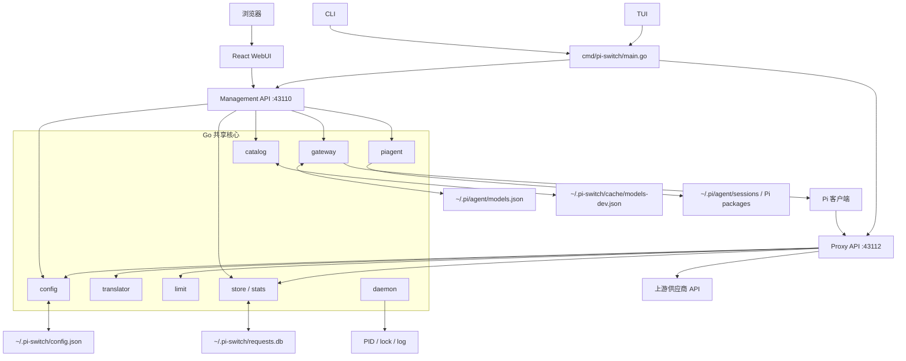

# pi-switch 后端架构罗盘

> 这是一份代码导航文档：先从入口定位，再沿真实调用链阅读实现。
>
> 核心原则：`config.json` 保存供应商事实，Gateway 是显式发布的派生视图，Proxy 负责请求路由与协议转换，`requests.db` 保存请求事实。
>
> 架构评估结论与行动清单见 `docs/architecture-review.md`；边界不变量见 `docs/system-contract.md`。

## 1. 先看哪里

| 目标 | 入口 | 继续阅读 |
|---|---|---|
| CLI 命令分发 | `cmd/pi-switch/main.go:main` | `handleProxy`、`handleWebUI`、`handleGatewayCLI` |
| WebUI 管理 API | `internal/server/server.go:NewMgmtRouter` | `profile_handlers.go`、`settings_handlers.go`、`stats_handlers.go`、`package_handlers.go`、`gateway_handlers.go` |
| Proxy 请求入口 | `internal/server/server.go:NewProxyRouter` | `proxy_handlers.go:handleChatCompletions`、`handleStream` |
| 供应商/渠道/模型 | `internal/config/config.go:PiSwitchConfig` | `ProviderProfile`、`Upstream`、`ModelEntry` |
| Gateway 预览与发布 | `internal/gateway/gateway.go:BuildCanonicalGatewayPlan` | `BuildProposedGatewayEntry`、`PublishPlan` |
| 协议转换 | `internal/translator/translator.go:PlanRequest` | `TransformRequest`、stream converter |
| Token 限制 | `internal/limit/` | request body clamp |
| 请求落库与统计 | `internal/store/`、`internal/stats/` | `logRequest`、Stats service |
| 模型目录 enrich | `internal/catalog/catalog.go` | `Ensure`、`FillMissing` / `FillOverwrite` |
| daemon 生命周期 | `internal/daemon/daemon.go` | PID、lock、health |
| 前端调用边界 | `webui/src/api.ts:api` | `apiSchema.ts`、React components |
| WebUI 嵌入 | `webui/embed.go:FS` | `webui/dist`、`internal/server` static routes |

## 2. 总体拓扑



## 3. Proxy 请求入口

```go
handleChatCompletions
```

单次请求大致经过以下步骤：

```text
客户端请求
   │
   ▼
读取 body / model / stream
   │
   ▼
加载 config.json
   │
   ▼
resolveRoute
   │
   ├── 检查 exposedModels
   ├── 查找 supplier/channel
   ├── 拒绝带 "/" 的旧模型 ID
   ├── 检查多渠道歧义
   └── 选择真实 upstream
   │
   ▼
读取模型元数据
   │
   ▼
limit clamp
   ├── contextWindow
   └── maxTokens
   │
   ▼
translator.PlanRequest
   ├── Chat Completions
   ├── Responses
   └── Anthropic Messages
   │
   ▼
构造上游请求
   │
   ▼
发送 upstream
   │
   ▼
转换 response / SSE
   │
   ▼
解析 usage、cost
   │
   ▼
写入 requests.db
```

### Proxy 入口对应代码

`internal/server` 按 handler 领域拆分为一个 kernel 加六个域文件，同属一个 package：

```text
internal/server/server.go             kernel：路由注册、认证、静态资源、构建信息、
                                      configPath/saveConfig/resolveModelsDevProvider
├── proxy_handlers.go                 handleChatCompletions、handleStream
├── profile_handlers.go               供应商/渠道/模型 profile 管理
├── gateway_handlers.go               gateway 预览与发布
├── package_handlers.go               pi 包安装与导入
├── settings_handlers.go              设置、备份、proxy/daemon 运行时状态
└── stats_handlers.go                 统计查询与日志导出
```

被两个以上域调用的 helper 必须留在 kernel；域文件之间不互相调用内部 helper。

```text
> `retry.go` 的重试/故障转移引擎**当前休眠**：代理路径只取单候选直通，
> `PUT /api/proxy/failover` 返回 410；该文件仍在用的是校验函数
> （`validateRetryFields`/`validateSettingsRetry`）。保留原因见
> `.scratch/remove-failover-chain/spec.md` D1。

internal/server/proxy_handlers.go
├── handleChatCompletions       非流式请求
├── handleStream                流式请求
├── resolveRoute                裸 model → supplier/channel
├── clampBody                   请求长度限制
└── logRequest                  SQLite 请求事实

internal/server/outbound.go
└── BuildOutboundRequest        上游 URL/header/body

internal/translator/translator.go
└── PlanRequest                 协议能力规划
```

### 路由语义

```text
requested model
      │
      ▼
config.json: upstream.exposedModels
      │
      ├── 0 个匹配 → 502 no_route
      ├── 1 个匹配 → 选择对应 supplier/channel
      └── 多个匹配 → 502 ambiguous
```

请求中的 `model` 必须是裸 ID；带 `/` 的旧式 provider/model ID 会在代理入口直接拒绝。

## 4. Gateway 预览与发布入口

```go
BuildCanonicalGatewayPlan
```

```text
config.json
   │
   ▼
BuildProposedGatewayEntry
   │
   ├── openai-responses    → pi-switch-res
   └── openai-completions  → pi-switch-chat
   │
   ▼
models.dev enrich
   │
   ▼
ReadCurrent
   └── 读取 models.json
   │
   ▼
CanonicalGatewayPlan
   ├── Current
   ├── Proposed
   ├── Added / Removed / Changed
   ├── Conflicts
   ├── PendingCount
   └── PreviewGroups
   │
   ▼
ValidateProposedGateway
   │
   ▼
PublishPlan
   ├── 保留第三方 provider
   ├── 合并 Gateway metadata
   ├── 写入临时文件
   └── rename 为 models.json
```

### Gateway 的事实边界

```text
config.json
  = Supplier / Channel / Model / exposedModels 唯一事实来源

models.json
  = 已发布给 Pi 客户端的 Gateway provider 视图

models.json 不会因为供应商修改自动写入。
只有 Gateway Publish / Apply to Pi 才会写入。
```

### Gateway API

```text
GET  /api/models/gateway
     读取 current，即 models.json 当前内容

GET  /api/models/gateway/preview
     根据 config.json 生成完整 proposed

POST /api/models/gateway/preview
     根据 selected / draft 生成子集 proposal

PUT  /api/models/gateway
     校验并原子发布 proposed
```

## 5. WebUI 调用链

```text
React component
      │
      ▼
webui/src/api.ts
      │  fetch /api/*
      ▼
webui/src/apiSchema.ts
      │  decode contract
      ▼
internal/server/server.go        kernel：NewMgmtRouter 注册 /api/*
      │
      ▼
config / gateway / store / piagent
```

WebUI 生产资源由 Vite 构建到 `webui/dist`，再由 `webui/embed.go` 嵌入 Go 二进制：

```text
webui/src
   │
   ▼
Vite build
   │
   ▼
webui/dist
   │
   ▼
//go:embed dist
   │
   ▼
bin/pi-switch
```

## 6. 核心持久化位置

| 文件 | 所有者 | 用途 |
|---|---|---|
| `~/.pi-switch/config.json` | `internal/config` | 供应商、渠道、模型池、暴露集 |
| `~/.pi/agent/models.json` | `internal/gateway` | Pi 已发布 provider 注册表 |
| `~/.pi-switch/requests.db` | `internal/store` | 请求不可变事实、usage、cost、latency |
| `~/.pi-switch/cache/models-dev.json` | `internal/catalog` | models.dev 元数据缓存 |
| `~/.pi-switch/backups/` | 配置保存流程 | 配置备份 |
| `~/.pi-switch/*.pid/*.log` | `internal/daemon` | daemon 生命周期信息 |
| `~/.pi/agent/sessions/` | Pi | pi session；pi-switch 只读扫描 |

## 7. 阅读和修改时的边界

1. 改供应商、渠道、模型暴露：从 `internal/config` 和对应 `/api/profiles/*` 入手。
2. 改 Pi 可见模型：从 `internal/gateway` 的 canonical plan 入手，不直接拼 `models.json`。
3. 改请求协议转换：从 `internal/translator` 入手，不在每个 handler 内重复转换。
4. 改上下文/输出限制：从 `internal/limit` 入手，不在各协议 handler 内分别 clamp。
5. 改统计展示：读取 `requests.db` 的事实，不反向修改请求 row。
6. 改 WebUI：优先经过 `webui/src/api.ts` 和 API decoder，不在组件内直接 `fetch`。
